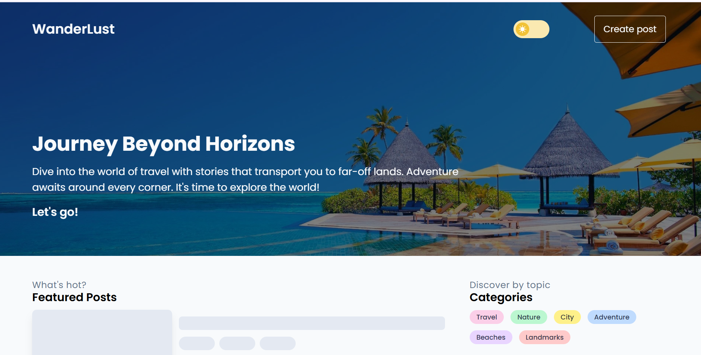
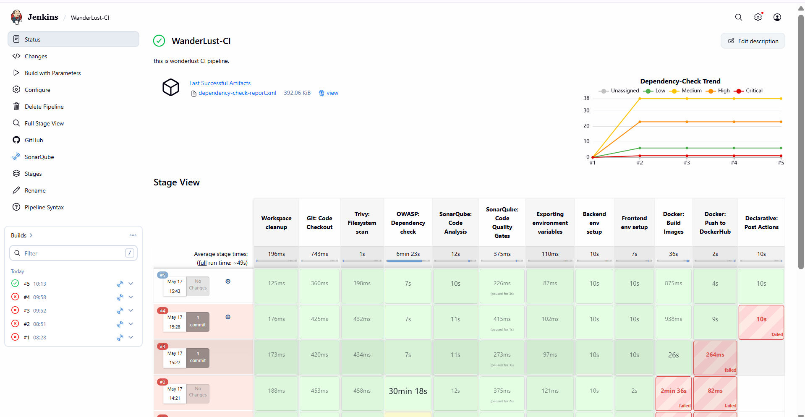
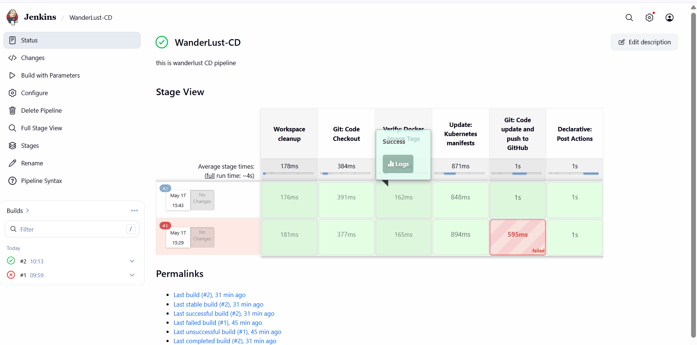
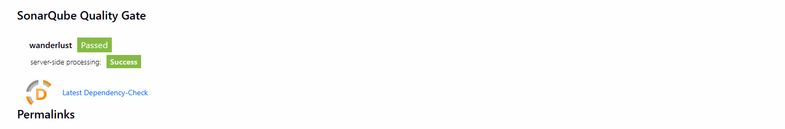
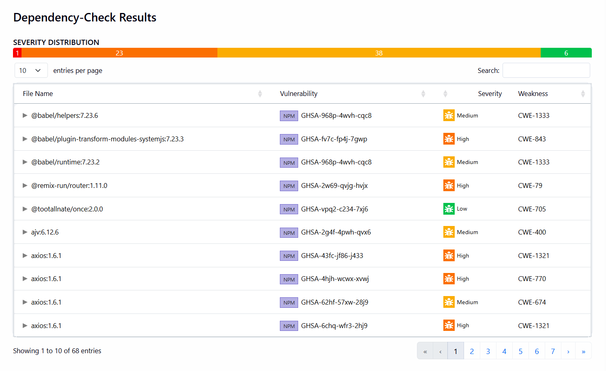
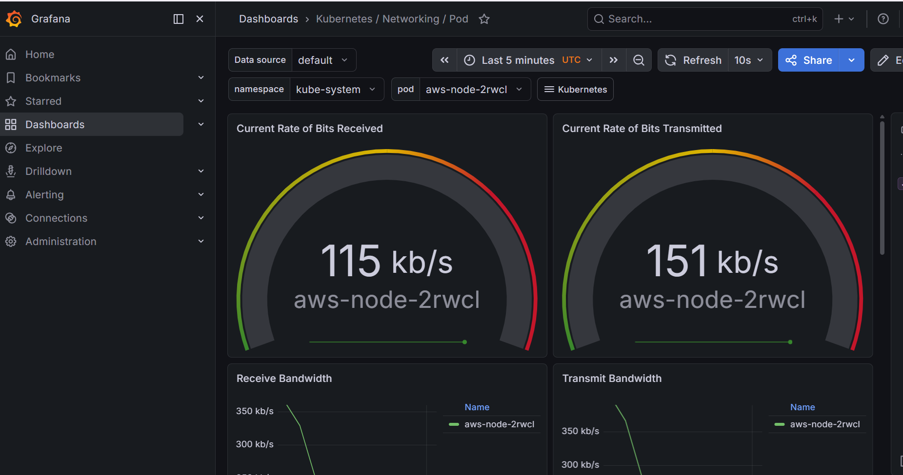

# Wanderlust Mega Project End to End Implementation

### In this demo, we will see how we deployed an end to end three tier MERN stack application on EKS cluster.

#

## Tech stack used in this project:
- GitHub (Code)
- Docker (Containerization)
- Jenkins (CI)
- OWASP (Dependency check)
- SonarQube (Quality)
- Trivy (Filesystem Scan)
- ArgoCD (CD)
- Redis (Caching)
- AWS EKS (Kubernetes)
- Helm (Monitoring using grafana and prometheus)

### How pipeline will look after deployment:
- <b>CI pipeline </b>

- <b>CD pipeline </b>

- <b>SonarQube Checks</b>

- <b>OWASP Dependency Check Checks</b>

- <b>Grafana Dashboard</b>

